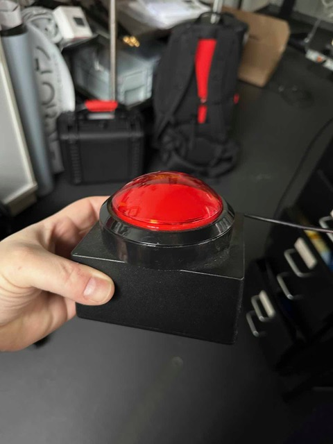

serial-button-osc
=================



Send an OSC message when a big red button is pressed.

This code base has been developed by [ZKM | Hertz-Lab](https://zkm.de/en/about-the-zkm/organization/hertz-lab) as part of the project [»The Intelligent Museum«](#the-intelligent-museum). 

Copyright (c) 2023 ZKM | Karlsruhe.  
Copyright (c) 2023 Dan Wilcox.  

BSD Simplified License.

Description
-----------

I got a big red button with a USB cable from the Videostudio. Inside the box is a microcontroller which communicates over a serial port and sends a '3' character when the button is pressed.

This project simply listens for the character and sends an OSC message on a button press.

Dependencies
------------

* Python 3
* [pyserial](https://github.com/pyserial/pyserial)
* [python-osc](https://github.com/attwad/python-osc)

Setup
-----

Install Python 3, if not already available. For instance, on macOS using [Homebrew](http://brew.sh):

```shell
brew install python3
```

Create a virtual environment and install the script's dependencies:

```shell
make
```

Running
-------

Next, start listening on a serial port via the virtual environment wrapper script:

    ./serial-button-osc /dev/tty.usbserial-310

The program will simply run in a loop and sends a `/button` OSC message whenever a '3' character is received. To modify behavior, use the commandline option flags.

`./serial-button-osc` help output:
~~~
usage: serial-button-osc.py [-h] [-a ADDR] [-p PORT] [-r RATE] [-c CHAR] [-v] [DEV] [MESSAGE]

send an OSC message when a big red button is pressed

positional arguments:
  DEV                   serial port device, default: /dev/ttyAMA0
  MESSAGE               OSC message address, default: /button

options:
  -h, --help            show this help message and exit
  -a ADDR, --address ADDR
                        destination hostname or IP address, default: 127.0.0.1
  -p PORT, --port PORT  destination port to send to, default: 6000
  -r RATE, --rate RATE  serial port baud rate, default: 115200
  -c CHAR, --char CHAR  serial char for button press, default: '3'
  -v, --verbose         enable verbose printing
~~~

For example, to send "/do/something" when a 'b' char is received over the "/dev/tty.usbserial-310" serial device:

    ./serial-button-osc.py --verbose -c b /dev/tty.usbserial-310 /do/something

To stop serial-button-osc, use CTRL+C to issue an interrupt signal.

### Calling Python script directly

The Python script can be called directly without the wrapper script, but requires manually enabling or disabling the virtual environment:

Activate the virtual environment before the first run in a new commandline session:

    source venv/bin/activate

Use:

    ./baton.py -h

When finished, deactivate the virtual environment with:

    deactivate

Example Clients
---------------

An example clients is included:

* pd/recvclient.pd: Pure Data patch which receives OSC messages

Start the recv client and serial-button-osc. Pressing the button should result in a message receive event and a virtual button flash in the pd patch.

Making a Button with an Arduino
-------------------------------

A simple serial button can be made using an analog button or switch with an Arduino microcontroller.

Basic wiring diagram:
~~~
3.3V -> button -> 10k Ohm -> GND
              \-> D2
~~~

To create a serial button:
1. Connect a button to an Arduino using the above diagram
2. Plug the Arduino into the development computer
3. Using the Arduino software, compile and upload the `arduino/ButtonChar` sketch to the Arduino
4. To test, enable the Arduino serial console, select a baud of 115200, and look for a char when the button is pressed

Checking Serial Connection
--------------------------

On macOS and Linux, the serial port can be connected to as a text console via `cu`:

    sudo cu -s 115200 -l /dev/tty.usbserial-310

When connected, cu will print received bytes as plain ASCII text.

To exit, type "~." and wait for cu to disconnect.

The Intelligent Museum
----------------------

An artistic-curatorial field of experimentation for deep learning and visitor participation

The [ZKM | Center for Art and Media](https://zkm.de/en) and the [Deutsches Museum Nuremberg](https://www.deutsches-museum.de/en/nuernberg/information/) cooperate with the goal of implementing an AI-supported exhibition. Together with researchers and international artists, new AI-based works of art will be realized during the next four years (2020-2023).  They will be embedded in the AI-supported exhibition in both houses. The Project „The Intelligent Museum” is funded by the Digital Culture Programme of the [Kulturstiftung des Bundes](https://www.kulturstiftung-des-bundes.de/en) (German Federal Cultural Foundation) and funded by the [Beauftragte der Bundesregierung für Kultur und Medien](https://www.bundesregierung.de/breg-de/bundesregierung/staatsministerin-fuer-kultur-und-medien) (Federal Government Commissioner for Culture and the Media).

As part of the project, digital curating will be critically examined using various approaches of digital art. Experimenting with new digital aesthetics and forms of expression enables new museum experiences and thus new ways of museum communication and visitor participation. The museum is transformed to a place of experience and critical exchange.


